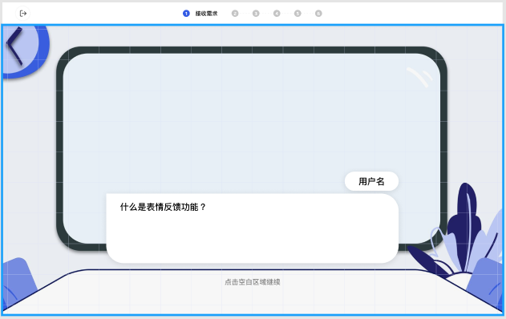
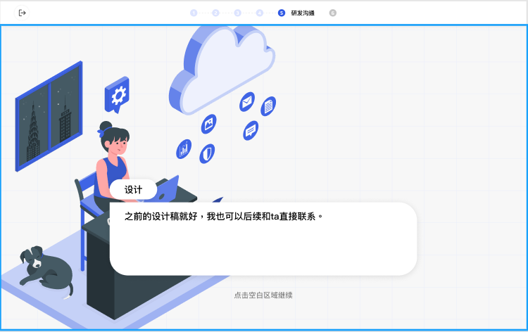

# Front End Train

# 探元素模拟产品前端技术栈
1. Typescript ：typescript是js的超集，增加了一些编译阶段的语法糖，增加了js的可读性。
2. React：React是一个js的框架，但它不仅仅是一种框架，更是一种新的开发模式，以往我们只能在固定的HTML结构中，使用js做一些有限的操作。而react则革命性把web开发变为了像客户端开发（如QT,.NET,安卓）相似组件式开发，使得开发动态网站更加方便。
3. Bootstrap4 ：这是一个CSS库，便于CSS渲染。

# 推荐学习路线（按顺序）
1. 熟悉回顾基础的HTML+CSS+JS, 重点回顾理解HTML的DOM结构，CSS的盒子模型，这些知识网上许多资源，这是我之前略微总结的blog，可以稍微看下：https://www.jianshu.com/p/b06a7deedcb0
2. Bootstrap4，重点熟悉CSS3中的弹性盒子概念，Bootstrap4做了一层封装，项目中用的比较多，这里可以直接看Bootstrap4的官方文档
3. React可以跟着它官网的上手项目[九宫格](https://reactjs.org/tutorial/tutorial.html)做完，推荐自己在本地搭建开发环境进行。另外强烈推荐阅读React设计的一些[最佳实践经验]（https://zh-hans.reactjs.org/docs/thinking-in-react.html#gatsby-focus-wrapper）

# Little project
## 介绍
实现一个对话推进的小项目，ui大致如下：

## 要求
1. 点击对话框，将会推进对话，上方导航栏和具体内容将会变化，即一句话一个为一个步骤
2. 对话形式为用户一句，对方一句，共六句话
3. 如UI所示用户在右，对方在左
4. 左上角返回按钮点击后回到第一句话的场景
5. 背景图随意，可做成固定的也可做成随对话变化的
6. 使用Typescript + React + Bootstrap4布局完成

## 关于开发的一点小看法

我个人认为任何工业界广泛应用的技术都不会太深奥，也就是有天花板的。开发人员的能力我认为不在于写代码多熟练，而是在于对于任何一个需求想出解决方案的能力，方案稳定性的差距以及思考的速度就是能力的体现。开发的乐趣不在写代码，而在求解解决方案的过程，比如如何设计模块间的关系使得耦合最低，如何使得系统的边界情况在考虑之中等等。

## 加油！一起成为一个优秀的方案思考者！
